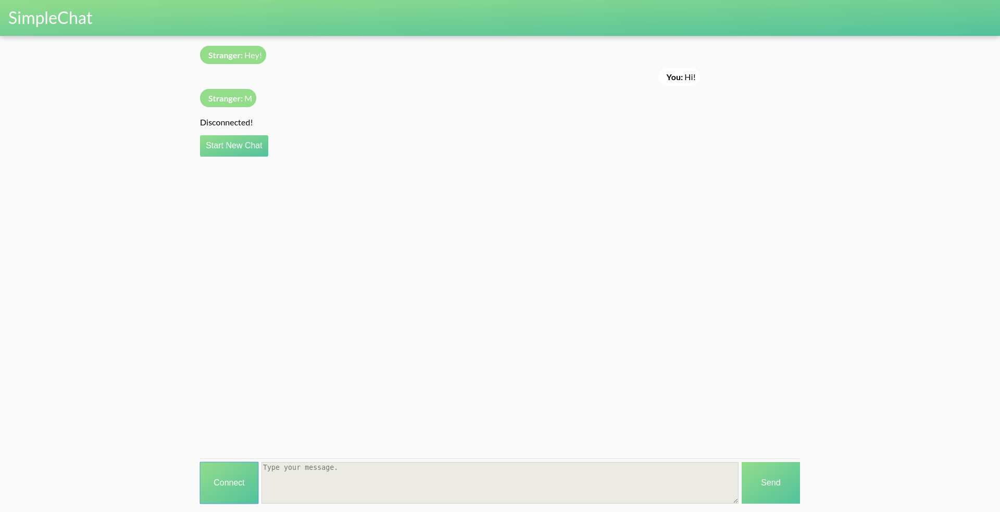

# SimpleChat
SimpleChat is an Omegle clone built as an exercise to learn the Socket.IO library. 



# Main Features 

- **Talk To Strangers!**
- **Amuse The NSA!** 
- **Disappoint Your Family!** 

# Getting Started (Locally) 

1. Run ```npm install```
1. Run ```node index.js``` 

Last Updated - December 2018 
